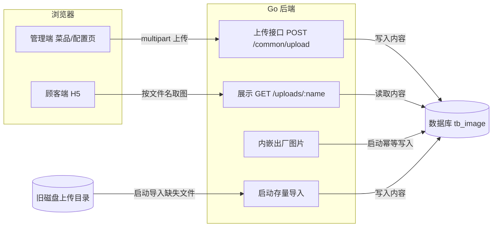

# Feature：图片存储从本地磁盘迁移到数据库

**作者**：CodeBuddy（planning 调研 + 起草）
**日期**：2026-09-22
**状态**：Approved（2026-09-22：subagent 按 spec-review 准则评审，4 项阻塞问题已修复后通过；用户已委派 gate「你来继续」）

---

## 1. 需求背景

### 1.1 问题与场景

当前系统的菜品图、收款码、店铺 Logo 等图片以「本地磁盘文件」形式存储，数据库中只存相对路径。由此带来的问题：

- **文件与数据分离**：数据库（SQLite 文件或 MySQL）有成熟的备份/迁移路径，磁盘上的图片目录没有。换服务器、重装系统、误删目录都会导致图片永久丢失，表现为菜品图/收款码 404。
- **无冗余**：生产服务器只有一块磁盘、没有额外磁盘可做备份盘；发版脚本的备份只覆盖程序产物，不含图片目录。
- **运维心智负担**：图片是否完好依赖启动审计的告警日志，事后才能发现，无法预防。

用户（系统所有者）在 2026-09-22 明确提出：图片存储量很小，希望把图片内容直接存入数据库，使图片随数据库一起备份/迁移，彻底消除磁盘文件这一丢失源。

### 1.2 现状分析

以下均为代码调研事实（verified）：

- **上传链路**：`POST /api/common/upload`（需登录）接收 multipart 文件，校验大小（≤5MB）、扩展名白名单（jpg/jpeg/png/gif/webp/bmp）、内容真实性（完整解码/魔数校验），通过后写入环境变量 `UPLOAD_DIR`（默认 `./uploads`）指定的磁盘目录，返回 `/uploads/<文件名>`。
- **展示链路**：后端注册 `GET /uploads/*file` 从磁盘读文件返回（带防目录穿越与缺失告警）；生产环境 Nginx 将 `/uploads/` 反代到后端；开发环境 Vite 同样代理到后端。
- **数据存储**：`tb_dish.dish_image` 与 `tb_config.cfg_value`（收款码/Logo 键）存 `/uploads/<文件名>` 相对路径；路径前缀常量 `UploadURLPrefix` 统一三处（上传返回值、后端路由、Nginx）。
- **种子图**：21 张菜品图 + 2 张收款码（约 8MB）随仓库放在 `backend/uploads/`，发布打包带上、部署脚本以「不覆盖已有」方式补齐到服务器上传目录。
- **启动审计**：`AuditDishImages` 启动时校验菜品图引用与磁盘文件一一对应，缺失打 `[warn]`。
- **数据库双后端**：SQLite（默认）与 MySQL 通过方言模板体系同时支持（自增主键/建表尾选项按方言替换），全量 SQL 脚本由 `gensql` 从 Go 定义生成；另有 `sqlite2mysql.py` 辅助跨库数据迁移（当前不含图片）。
- **图片量级**：当前仅 23 张种子图 + 少量用户上传（用户确认「图片存储很少」）。

## 2. 目标与非目标

### 2.1 目标

1. **（P0）图片随数据库走**：图片内容持久化于数据库；服务重启、更换工作目录、整库迁移（备份/恢复数据库）后图片均正常显示，磁盘文件不再参与运行时展示。
2. **（P0）对外契约不变**：上传接口的请求/响应格式、图片 URL 形态（`/uploads/<文件名>`）保持不变，前端与 Nginx 零改动。
3. **（P1）存量自动迁移**：已部署环境升级后首次启动，磁盘上已有的图片自动进入数据库，无需人工操作；过程幂等、不删除磁盘文件。
4. **（P1）全新部署自包含**：出厂图片（菜品图与收款码）随后端程序分发，新环境启动即有图，发布链路不再携带磁盘图片目录。
5. **（P1）双数据库后端一致**：新存储能力在 SQLite 与 MySQL 上行为一致。

### 2.2 非目标

- 不接入对象存储/CDN（当前量级不需要，见 §5）。
- 不做图片压缩、裁剪、格式转换。
- 不做「未被引用图片」的清理/回收策略（避免误删仍被引用的历史图；量级小，留库无害）。
- 前端页面不做任何改动。

## 3. 需求

### 3.1 功能性需求

- **FR1 上传**：上传接口的请求（multipart 字段 `file`）、响应（`{fileName, url}`，`url` 形如 `/uploads/<文件名>`）与鉴权要求保持现状；校验规则（≤5MB、扩展名白名单、内容真实性）保持现状；上传成功后图片内容及其元信息（文件名、MIME 类型、字节数）持久化于数据库。
- **FR2 展示**：`GET /uploads/<文件名>` 返回数据库中该文件的图片内容，响应头含正确的 Content-Type；文件名不存在时返回 404 JSON 错误体（与现状一致）。同一文件名对应的图片内容不可变。
- **FR3 出厂图片**：全新数据库首次启动后，21 张菜品图与 2 张收款码在数据库中可读；重复启动不产生重复记录。
- **FR4 存量迁移**：旧版本升级后启动时，系统自动将旧磁盘上传目录中「数据库缺失」的图片导入数据库；导入幂等（重复启动不重复导入、不覆盖数据库已有记录）；磁盘文件保留不删。
- **FR5 启动审计**：启动时校验业务表引用的图片路径在数据库中均有对应内容，缺失则输出告警日志（沿用现有告警口径）。
- **FR6 错误行为**：上传失败（校验不过/存储失败）按现有错误协议返回 400 与中文提示；展示查询失败返回 404，不暴露内部错误细节。

### 3.2 非功能性需求

- **性能**：图片总量当前 ≤ 8MB、预期增长缓慢（单店餐饮场景）。顾客端菜单页一次全量加载 21 张出厂图（冷数据、无缓存）总耗时 ≤ 2 秒；缓存命中后总耗时 ≤ 100ms（本地 SQLite 部署，冒烟验收）。
- **兼容性**：升级路径无需停机人工干预；回滚到旧版本后系统仍可正常运行（磁盘文件未删除，旧版直接读盘）。
- **可维护性**：新表结构进入现有「Go 定义为唯一来源、SQL 脚本生成」的机制，两库脚本不手工维护。

### 3.3 约束

- 业务表中已存的图片路径（`/uploads/<文件名>` 形态）与语义不变；升级后已可见的图片内容不得被改变（升级前后展示内容一致）。
- 上传接口与图片 URL 是前端既有依赖，属于不能破坏的对外契约。
- 系统必须同时运行于 SQLite 与 MySQL（现有双方言体系）；现有跨库数据迁移工具必须能完整搬运图片内容，迁移过程无损。
- 外部环境约束：MySQL 服务端单语句包上限（`max_allowed_packet`）在 5.7 默认值（4MB）小于单图上限（5MB），该外部限制无法由本系统消除，需文档说明部署要求。

## 4. 设计方案

### 4.1 方案总览

新增一张图片内容表（文件名唯一键 + 二进制内容 + MIME + 大小 + 时间），上传改为写库、展示改为读库；出厂图片通过 `go:embed` 编译进后端二进制，启动时幂等写入；旧磁盘目录降级为「存量导入源」，启动时补齐数据库缺失项。业务表中的 `/uploads/<文件名>` 路径原样保留，仅解析方从磁盘换为图片表。

### 4.2 前提与系统不变量

**Assumptions**（已与用户确认或代码验证）：

- 图片量级小且增长缓慢（用户确认「图片存储很少」，当前 23 张/8MB）。——verified（用户）
- 用户上传的文件名全局唯一（「时间戳+纳秒」生成规则，verified 代码）；出厂图片为固定名。——verified（代码）
- **同名文件的磁盘内容与内嵌出厂图可能不一致**（历史部署允许手工替换磁盘文件，部署脚本亦「不覆盖线上已有」）——因此升级导入必须定义权威顺序，见 §4.5.4；不能假设「同名即同内容」。
- 磁盘目录不是可信数据源（可能缺文件/被清理），仅作一次性补齐导入源。——design decision

**System-level invariants**：

- 业务表引用的每个 `/uploads/<文件名>` 与图片表中的记录一一对应（文件名为键）。
- 运行时展示**只读数据库**，不回退读磁盘——避免双数据源歧义；磁盘与库不一致时以库为准并由审计告警。
- 图片表内「文件名 → 内容」映射不可变：记录一旦写入不更新（新图片必得新名字；升级导入遵循「先到先得」，见 §4.5.4）。

### 4.3 接口与协议

- `POST /api/common/upload`：请求/响应不变。
- `GET /uploads/<文件名>`：响应体来源从磁盘文件变为数据库记录；新增响应头 `Content-Type`（取存储的 MIME，缺省按扩展名映射）与 `Cache-Control: public, max-age=31536000, immutable`（依据「文件名→内容不可变」不变量）；404 语义与响应体格式不变。
- 配置项 `UPLOAD_DIR`（`config.yaml` 的 `server.upload_dir`）：语义从「上传存储目录」变为「存量磁盘图片导入源」，默认值不变；未配置或目录不存在时静默跳过导入。
- 表结构（sketch，非完整 DDL）：`tb_image(img_id 自增主键, img_name 唯一, content_type, img_data 二进制, file_size, create_time)`；二进制列类型按方言生成（SQLite `BLOB` / MySQL `LONGBLOB`）。
- MySQL 默认连接参数（`DB_PARAMS` 默认值）追加 `maxAllowedPacket=64M`；用户显式配置的 `DB_PARAMS` 优先不受影响。

### 4.4 组件设计

- **store 层（图片存取）**：新增图片存取职责——保存（上传写入）、按名读取、出厂图片幂等写入、磁盘存量导入、启动审计（改查库）。SQL 与方言适配留在 store 内，符合「store 是唯一数据访问层」的既有方向（见在途重构任务）。
- **seedimg 子包（出厂图片资源）**：持有内嵌图片文件与文件名清单，供 store 启动写入；独立子包是因为 `go:embed` 只能嵌入选中包目录下的文件。
- **handler 层（上传）**：校验逻辑不动，落库改为调 store 保存函数；响应拼装不变。
- **main（展示托管）**：`/uploads` 路由的处理从磁盘读取改为调 store 读取 + 进程内缓存；保留防目录穿越（文件名取 basename）与缺失告警日志。
- 依赖方向：`main → handler → store`、`main → store`、`store → seedimg`，无循环。

### 4.5 关键机制

#### 4.5.1 上传与命名

- 文件名生成规则不变（`dining_<时间戳>_<纳秒><扩展名>`），保证全局唯一。
- Content-Type 在写入时确定：按白名单扩展名映射（jpg/jpeg→image/jpeg、png→image/png、gif→image/gif、webp→image/webp、bmp→image/bmp），上传与存量导入共用同一映射。
- 写入用「遇唯一键冲突则忽略」的插入语义（两库方言已有该语句生成器），配合名字唯一索引保证幂等。

#### 4.5.2 展示与进程内缓存

- 每次展示先查进程内缓存（文件名 → 内容+MIME），未命中读库并回填。
- 缓存为有界（数百条量级）；因 key 不可变，无需失效机制；并发安全；超限时整体重置重建（粗粒度淘汰，在「名字不可变、量级小」前提下无正确性问题，实现零依赖）。

#### 4.5.3 出厂图片内嵌与幂等写入

- 图片文件移入后端源码目录，编译期嵌入；启动时对每个文件执行「冲突忽略」插入——只有图片表中尚无该文件名时才写入。
- 每次启动都执行（23 次插入的成本可忽略），不引入「是否已初始化」状态。
- **执行顺序在磁盘存量导入之后**（原因见 4.5.4 的权威顺序）。

#### 4.5.4 磁盘存量导入与权威顺序

- **权威顺序（升级兼容的关键）**：启动时先执行磁盘导入、后写入内嵌出厂图，两者都用「冲突忽略」插入——**首个写入者胜**。这样：老部署磁盘上已被商户实际使用的同名文件（例如手工替换过的收款码）先入库、内容得以保留；内嵌出厂图只填补真正缺失的名字。全新部署（无磁盘目录或目录为空）则全部由出厂图填充。
- 导入范围只限上传扩展名白名单（jpg/jpeg/png/gif/webp/bmp），其余文件跳过并记日志；不重复做内容真实性校验（磁盘文件来源于历史上已校验的上传与出厂图，且入库后只读）。
- 导入时若发现磁盘文件与库中同名记录大小不一致，打告警日志（提示人工核对），**不覆盖**库中记录——维持「记录一旦写入不更新」不变量。
- 任何单文件导入失败只记告警、不阻断启动。
- 文件保留原位不删，保证回滚到旧版本后旧逻辑（读盘）仍可用。

## 5. 备选方案

| 备选 | 内容 | Reject 理由（trade-off） | 重新考虑条件 |
|---|---|---|---|
| base64 文本列存库 | 图片编码为 base64 存 TEXT 列 | 比 二进制列多 ~33% 空间与一层编解码，无任何功能收益；两库驱动对二进制列原生支持 | 无（除非出现「必须用文本协议读图」的外部需求） |
| 保持磁盘存储 + 备份脚本 | 定时打包上传目录与数据库 | 未解决根因（单盘无冗余、换机丢文件）；备份恢复仍需人工保证目录与库同步；用户已明确否决 | 磁盘获得冗余（NAS/云盘挂载）且图片量级大幅增长 |
| 对象存储（COS/OSS）+ CDN | 上传直传对象存储，URL 存库 | 引入外部账号/网络依赖与费用，单店小量级明显 overkill；断网时连出厂图都显示不了 | 多实例部署、图片量大或需要公网加速时 |

## 6. 横切关注点

### 6.1 兼容性、升级与回滚

- **升级**：老库 + 磁盘图 → 新版启动 → 自动建新表 → 磁盘存量导入（先）→ 内嵌出厂图写入（后，仅补缺）→ 审计告警（若有缺失）。全程无人工数据操作；升级前可见的图片升级后内容不变（磁盘先入库的权威顺序保证，见 §4.5.4）。
- **回滚**：新版运行的任意时刻回滚到旧版二进制均安全——磁盘文件从未删除，旧版读盘逻辑直接可用；回滚窗口内旧版新上传的图片只在磁盘（新版再升级时由导入机制收编）。
- **数据兼容方向**：单向（磁盘 → 库）；库中记录不回写磁盘。
- **发布链路**：发布包不再携带磁盘图片目录；部署脚本移除种子图补齐步骤（出厂图已内嵌）。全量 SQL 脚本重新生成，含新表 DDL；出厂图片内容不进 SQL 种子脚本（由二进制在首次启动写入），脚本头部注释说明。
- **跨库迁移**：`sqlite2mysql.py` 纳入新表，二进制列以十六进制字面量导出。

### 6.2 故障处理与恢复

- 存量导入单文件失败：记告警、继续其余文件；目录不存在：静默跳过。
- 上传写库失败：按现有错误协议返回 400 中文提示，不落半条记录（单条插入原子）。
- 展示读库失败/未命中：404 + 告警日志（沿用现状口径），不尝试读磁盘兜底（见 §4.2 不变量）。
- 出厂图写入失败：记告警不阻断启动（与现有「配置审计」一致的非致命口径）。

### 6.3 并发与一致性

- 文件名唯一索引 + 「冲突忽略」插入：并发上传同名（概率可忽略）不会产生重复行。
- SQLite 并发读写沿用现有连接池与 `busy_timeout` 方言配置，无新增锁。
- 进程内缓存并发访问由 RWMutex 保护；SQLite/MySQL 事务隔离级别维持现状默认。

### 6.4 性能与资源模型

- **内存**：缓存上限数百条 × 平均数百 KB ≈ 数十 MB 封顶，可控；超出即清空重建。
- **数据库体积**：图片总量直接进库（当前 +8MB 量级），SQLite 单文件与 MySQL 均无压力。
- **热路径**：菜单页 21 图冷启动为 21 次索引点查 + blob 读（SQLite 本地文件，微秒-毫秒级）；命中缓存后为内存读取。相比磁盘方案无网络/磁盘寻道劣化。
- **二进制体积**：+8MB（内嵌出厂图）。

### 6.5 可观测性与运维

- 启动日志：出厂图写入条数、存量导入条数（含跳过数）、审计缺失告警（具体文件名清单）。
- 运行日志：上传失败、展示缺失（含来源 IP，沿用现状）。
- 运维文档更新：配置项语义（`UPLOAD_DIR`）、MySQL `max_allowed_packet` 说明、迁移脚本用法。

### 6.6 安全性

- 上传校验链（大小/扩展名/内容真实性）不变，不引入新攻击面。
- 展示仍以文件名为键（取 basename 防目录穿越），无 SQL 注入面（参数化查询）。
- 图片经 `/uploads/` 公开可读——与现状一致（收款码本就用于顾客扫码），不视为泄露面。
- 二进制列内容不进操作审计日志（审计只记参数摘要，无变化）。

## 7. 测试计划

- **单元（store 层）**：存取 roundtrip（写入→按名读出字节与 MIME 一致）；幂等（同名重复写入不新增行、不覆盖）；出厂图写入（首启全量、重启不重复）；磁盘导入（目录有 3 文件/库有 1 → 导入 2；重复执行 0 导入；目录不存在跳过；非白名单扩展名跳过）；**同名冲突权威顺序**（磁盘与内嵌同名不同内容 → 磁盘内容胜出、内嵌不覆盖）；**大小不一致告警**（库已有记录与磁盘文件大小不同 → 不覆盖 + 告警）；审计（引用齐全通过、缺一告警）。
- **集成（handler/main，SQLite 内存或临时库）**：上传接口（合法 PNG → 200 且 url 可再次 GET 到同字节、Content-Type 正确；超限/伪造内容 → 400）；`/uploads/<名>` 命中/404。
- **迁移与兼容**：`gensql -check` 通过（脚本与 Go 定义一致）；`sqlite2mysql.py` 导出含新表且二进制内容无损（行数与抽样字节比对）。
- **性能冒烟（对应 §3.2 阈值）**：本地 SQLite、清空缓存后加载全部 21 张出厂图，总耗时 ≤ 2s；二次加载（缓存命中）≤ 100ms。
- **冒烟（人工，SQLite）**：全新目录启动（无磁盘图）→ 菜单页图片全显；模拟升级（磁盘放旧图，含一张与出厂图同名但内容不同的文件）→ 启动导入 → 菜单页显示磁盘版内容 → 删除磁盘目录 → 重启 → 图片仍全显且内容不变。

## 8. 未决问题与风险

**Open Questions**：无重大未决（存储格式、契约、迁移路径均已定）。

**Known Risks**：

| 风险 | Detection | Mitigation |
|---|---|---|
| MySQL 5.7 服务端 `max_allowed_packet` 默认 4MB，5MB 图片写入被拒 | 上传返回 400 + 错误日志（含驱动报错） | 客户端默认参数已放行（`maxAllowedPacket=64M`）；文档注明服务端需 `SET GLOBAL max_allowed_packet=64M`；上传上限不放宽 |
| 大图拖慢顾客端菜单首屏（冷缓存 21 次 blob 读） | §7 性能冒烟计时超阈值（2s/100ms） | 进程内缓存（首访后常驻）；超标时运维手段控制单图体积（压缩后再上传），不放宽 §3.2 阈值 |
| 磁盘文件与内嵌出厂图同名但内容不同（历史手工替换），升级后展示与商户预期不符 | 启动导入的大小不一致告警日志（§4.5.4） | 权威顺序已保证磁盘内容胜出（升级前后可见内容不变）；告警提示人工核对，确需换图走正常上传流程（新名字） |
| 回滚到旧版期间上传的图只存在于磁盘，旧版读不到 | 旧版启动审计 `[warn]`（「库里有引用、磁盘无文件」）即触发信号；或回滚后菜单页缺图可直接观察 | 运维 SOP（写入部署文档）：回滚前停用上传入口；回滚后若新上传图必须可见，按文档示例用 SQL 将库中该图导出落盘（量级小、人工可操作；本期不开发导出工具） |

## 9. 参考资料

- 上传处理：`backend/internal/handler/upload.go`（校验链、命名、落盘现状）
- 静态托管与启动流程：`backend/main.go`（`/uploads` 路由、审计调用、目录创建）
- 表结构模板与迁移：`backend/internal/store/schema.go`（`{{PK}}`/`{{OPTS}}` 方言占位符、幂等迁移）
- 种子与审计：`backend/internal/store/seed.go`（`UploadURLPrefix`、`AuditDishImages`、种子数据）
- 方言层：`backend/internal/store/dialect.go`（冲突忽略插入语句生成、连接池、DSN 默认参数）
- SQL 脚本生成：`backend/cmd/gensql/main.go`、`backend/internal/store/sqlgen.go`
- 跨库迁移：`backend/scripts/sqlite2mysql.py`
- 发布/部署：`release.sh`、`deploy/deploy.sh`（种子图打包与补齐现状）
- 出厂图片：`backend/uploads/`（23 个文件，8MB）
- 用户需求：2026-09-22 会话（图片改存 DB 的明确指示与「图片存储很少」的量级确认）
